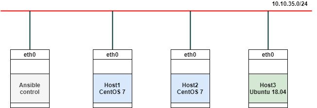

# Cài đặt Ansible 

### Mô hình lab 



Trong phần lab cài đặt này, mình sử dụng 4 máy trong đó có 1 máy đóng vai trò là `Ansible Control`, các máy còn lại đóng vai trò là host được quản lý bởi `Ansible Control`. 

### IP planning

|Hostname|OS|IP|
|-|-|-|
|Ansible control|CentOS 7|10.10.35.197|
|Host1|CentOS 7|10.10.35.196|
|Host2|CentOS 7|10.10.35.194|
|Host3|Ubuntu 18.04|10.10.35.193|

## 1. Cài đặt Ansible 

Thực hiện trên Ansible control. Login bằng tài khoản root và thực hiện như sau:

- Update gói và thực hiện cài đặt Ansible

```
yum install -y epel-release 
yum update -y

yum install -y ansible
```

- Kiểm tra phiên bản Ansible đã cài đặt 

```
[root@ansible-control ~]# ansible --version
ansible 2.9.14
  config file = /etc/ansible/ansible.cfg
  configured module search path = [u'/root/.ansible/plugins/modules', u'/usr/share/ansible/plugins/modules']
  ansible python module location = /usr/lib/python2.7/site-packages/ansible
  executable location = /usr/bin/ansible
  python version = 2.7.5 (default, Oct 14 2020, 14:45:30) [GCC 4.8.5 20150623 (Red Hat 4.8.5-44)]
```

## 2. Cấu hình SSH key và khai báo inventory trên Ansible Control

Ansible hoạt động theo cơ chế agentless, nên ta không cần phải cài agent vào các máy client để điều khiển. Ansible sẽ sử dụng ssh để điều khiển các client. Do vậy, ta có thể dùng ssh thông thường hoặc ssh key để có thể điều khiển các máy client.

Tuy nhiên, nếu sử dụng ssh thông thường sẽ dễ bị lộ mật khẩu vì password sẽ được khai báo dưới dạng cleartext. Do vậy, trong bài lab này mình sẽ sử dụng ssh key để ssh vào và monitor các host. 

### 2.1 Cấu hình SSH key 

Tạo ssh key và copy nó sang các node còn lại. 

- Tạo key 

```
ssh-keygen
```

Sau khi có ssh key, ta lần lượt ssh sử dụng key id để ssh vào các host để monitor. 

- Thực hiện copy sang các host. 

```
ssh-copy-id root@10.10.35.196
```

Nhập vào mật khẩu root để đăng nhập vào các host. Sau đó sẽ có thông báo đã loggin thành công, bạn có thể ssh trực tiếp mà không cần nhập mật khẩu. 

```
[root@ansible-control ~]# ssh-copy-id root@10.10.35.196
/usr/bin/ssh-copy-id: INFO: Source of key(s) to be installed: "/root/.ssh/id_rsa.pub"
The authenticity of host '10.10.35.196 (10.10.35.196)' can't be established.
ECDSA key fingerprint is SHA256:w4sX+Gjo7tPz4+o56IK3kGSg3jjAf56GR+9FFAf6XLw.
ECDSA key fingerprint is MD5:11:71:55:39:3d:30:53:db:38:f5:b1:d9:9f:75:97:99.
Are you sure you want to continue connecting (yes/no)? yes
/usr/bin/ssh-copy-id: INFO: attempting to log in with the new key(s), to filter out any that are already installed
/usr/bin/ssh-copy-id: INFO: 1 key(s) remain to be installed -- if you are prompted now it is to install the new keys
root@10.10.35.196's password:

Number of key(s) added: 1

Now try logging into the machine, with:   "ssh 'root@10.10.35.196'"
and check to make sure that only the key(s) you wanted were added.

```

Tương tự như vậy, ta tiến hành ssh key vào các host còn lại. 

```
ssh-copy-id root@10.10.35.194
```

```
ssh-copy-id root@10.10.35.193
```

### 2.2 Khai báo inventory 

- Backup lại file chuẩn bị cấu hình. 

```
mv /etc/ansible/hosts /etc/ansible/hosts.bak
```

- Tạo file host mới để khai báo các host. 

```
vi /etc/ansible/hosts
```

- File cấu hình sẽ có dạng như sau: 

```
[centos7]
host1-10.10.35.196 ansible_host=10.10.35.196 ansible_port=22 ansible_user=root
host2-10.10.35.194 ansible_host=10.10.35.194 ansible_port=22 ansible_user=root

[ubuntu18]
host3-10.10.35.193 ansible_host=10.10.35.193 ansible_port=22 ansible_user=root
```

>Lưu ý: Ta có thể sử dụng `[]` để khai báo tên các group. Các group này do ta quy hoạch sao cho phù hợp với hệ thống.Tên, địa chỉ của host, các port sử dụng để ssh và các user để ssh vào các host. 

- Thực hiện kiểm tra danh sách các host đã được khai báo trong file inventory sử dụng lệnh sau: 

```
ansible all --list-hosts
```

Ta sẽ được kết quả như sau: 

```
[root@ansible-control ~]# ansible all --list-hosts
  hosts (3):
    host1-10.10.35.196
    host2-10.10.35.194
    host3-10.10.35.193
```

- Thực hiện kiểm tra theo 2 group đã khai báo là `centos7` và `ubuntu18`

```
[root@ansible-control ~]# ansible centos7 --list-hosts
  hosts (2):
    host1-10.10.35.196
    host2-10.10.35.194
```
```
[root@ansible-control ~]# ansible ubuntu18 --list-hosts
  hosts (1):
    host3-10.10.35.193
```

### 2.3 Kiểm tra các host được kết nối 

Sử dụng ping để kiểm tra các kết nối từ ansible control đến các host. Nếu trạng thái trả về `SUCCESS` tức là các host đang hoạt động, còn nếu trạng thái trả về `UNREACHABLE!` tức là các host đó không hoạt động hoặc không thể kết nối tới host đó. 

- Kiểm tra tất cả các host đã khai báo. 
```
ansible all -m ping
```
```
[root@ansible-control ~]# ansible all -m ping
host1-10.10.35.196 | SUCCESS => {
    "ansible_facts": {
        "discovered_interpreter_python": "/usr/bin/python"
    },
    "changed": false,
    "ping": "pong"
}
host2-10.10.35.194 | SUCCESS => {
    "ansible_facts": {
        "discovered_interpreter_python": "/usr/bin/python"
    },
    "changed": false,
    "ping": "pong"
}
host3-10.10.35.193 | SUCCESS => {
    "ansible_facts": {
        "discovered_interpreter_python": "/usr/bin/python3"
    },
    "changed": false,
    "ping": "pong"
}
```

- Kiểm tra các host trong 1 group 

```
[root@ansible-control ~]#  ansible centos7 -m ping
host1-10.10.35.196 | SUCCESS => {
    "ansible_facts": {
        "discovered_interpreter_python": "/usr/bin/python"
    },
    "changed": false,
    "ping": "pong"
}
host2-10.10.35.194 | SUCCESS => {
    "ansible_facts": {
        "discovered_interpreter_python": "/usr/bin/python"
    },
    "changed": false,
    "ping": "pong"
}
```

```
[root@ansible-control ~]# ansible ubuntu18 -m ping
host3-10.10.35.193 | SUCCESS => {
    "ansible_facts": {
        "discovered_interpreter_python": "/usr/bin/python3"
    },
    "changed": false,
    "ping": "pong"
}
```

## 3. Thực hiện các module căn bản

Đầu tiên khi tiếp cận với Ansible, ta sẽ sử dụng các module ở chế độ tương tác, tức là ta sẽ thử chạy các lệnh của từng module 1 và phân biệt được cách sử dụng của các module đó.

### 3.1 Module command

Về cơ bản, ta có thể hiểu rằng module command giúp ta thực thi các lệnh linux từ xa. Ví dụ mình muốn thực hiện lệnh `ls` trên các host, mình có thể làm như sau: 

```
ansible all -m command -a "ls"
```

```
[root@ansible-control ~]# ansible all -m command -a "ls"
host3-10.10.35.193 | CHANGED | rc=0 >>
hello
opendns-random-domains.txt
__pycache__
Tools_and_Script
umbrella-domains.txt
host2-10.10.35.194 | CHANGED | rc=0 >>
30day_python
anaconda-ks.cfg
Benmarkweb.py
bot-auto-send-and-receive-gmail
dnscan
dns.pcap
dns_subdomain
grab.py
master.zip
private-key.pem
pyredis
subdomains.txt
host1-10.10.35.196 | CHANGED | rc=0 >>
anaconda-ks.cfg
insllwpcentos7.sh
mysql-community-release-el7-5.noarch.rpm
original-ks.cfg
```
hoặc 

```
[root@ansible-control ~]# ansible ubuntu18 -m command -a "ls"
host3-10.10.35.193 | CHANGED | rc=0 >>
hello
opendns-random-domains.txt
__pycache__
Tools_and_Script
umbrella-domains.txt
```
```
[root@ansible-control ~]# ansible centos7 -m command -a "ls"
host1-10.10.35.196 | CHANGED | rc=0 >>
anaconda-ks.cfg
insllwpcentos7.sh
mysql-community-release-el7-5.noarch.rpm
original-ks.cfg
host2-10.10.35.194 | CHANGED | rc=0 >>
30day_python
anaconda-ks.cfg
Benmarkweb.py
bot-auto-send-and-receive-gmail
dnscan
dns.pcap
dns_subdomain
grab.py
master.zip
private-key.pem
pyredis
subdomains.txt
```

Hoặc có thể sử dụng module command để thực thi lệnh `uptime` trong linux. 

```
[root@ansible-control ~]# ansible all -m command -a "uptime"
host1-10.10.35.196 | CHANGED | rc=0 >>
 10:50:38 up 38 days, 23:22,  1 user,  load average: 0.00, 0.01, 0.05
host2-10.10.35.194 | CHANGED | rc=0 >>
 10:50:38 up 81 days, 15:05,  1 user,  load average: 0.00, 0.01, 0.05
host3-10.10.35.193 | CHANGED | rc=0 >>
 10:49:40 up 16 days, 14:33,  1 user,  load average: 0.00, 0.03, 0.03
```

### 3.2 Module setup 

Ta có thể sử dụng module setup để kiểm tra các thông tin tổng quát về hệ điều hành của các node.

- Sử dụng lệnh `'filter=ansible_default_ipv4'` trong module `setup` để liệt kê các địa chỉ IPv4 trên các node. 

```
[root@ansible-control ~]# ansible all  -m setup -a 'filter=ansible_default_ipv4'
host1-10.10.35.196 | SUCCESS => {
    "ansible_facts": {
        "ansible_default_ipv4": {
            "address": "10.10.35.196",
            "alias": "eth0",
            "broadcast": "10.10.35.255",
            "gateway": "10.10.35.1",
            "interface": "eth0",
            "macaddress": "52:54:00:2e:12:75",
            "mtu": 1500,
            "netmask": "255.255.255.0",
            "network": "10.10.35.0",
            "type": "ether"
        },
        "discovered_interpreter_python": "/usr/bin/python"
    },
    "changed": false
}
host2-10.10.35.194 | SUCCESS => {
    "ansible_facts": {
        "ansible_default_ipv4": {
            "address": "10.10.35.194",
            "alias": "eth0",
            "broadcast": "10.10.35.255",
            "gateway": "10.10.35.1",
            "interface": "eth0",
            "macaddress": "52:54:00:68:38:19",
            "mtu": 1500,
            "netmask": "255.255.255.0",
            "network": "10.10.35.0",
            "type": "ether"
        },
        "discovered_interpreter_python": "/usr/bin/python"
    },
    "changed": false
}
host3-10.10.35.193 | SUCCESS => {
    "ansible_facts": {
        "ansible_default_ipv4": {
            "address": "10.10.35.193",
            "alias": "eth0",
            "broadcast": "10.10.35.255",
            "gateway": "10.10.35.1",
            "interface": "eth0",
            "macaddress": "52:54:00:ef:7b:7c",
            "mtu": 1500,
            "netmask": "255.255.255.0",
            "network": "10.10.35.0",
            "type": "ether"
        },
        "discovered_interpreter_python": "/usr/bin/python3"
    },
    "changed": false
}
```

- Sử dụng lệnh `'filter=ansible_distribution'` để kiểm tra các distro của host. 

```
[root@ansible-control ~]# ansible all  -m setup -a 'filter=ansible_distribution'
host2-10.10.35.194 | SUCCESS => {
    "ansible_facts": {
        "ansible_distribution": "CentOS",
        "discovered_interpreter_python": "/usr/bin/python"
    },
    "changed": false
}
host1-10.10.35.196 | SUCCESS => {
    "ansible_facts": {
        "ansible_distribution": "CentOS",
        "discovered_interpreter_python": "/usr/bin/python"
    },
    "changed": false
}
host3-10.10.35.193 | SUCCESS => {
    "ansible_facts": {
        "ansible_distribution": "Ubuntu",
        "discovered_interpreter_python": "/usr/bin/python3"
    },
    "changed": false
}
```

Kết quả trả về các distro của host là ubuntu hay centos. 

Như vậy, việc cài đặt ansible về cơ bản đã hoàn tất. Tiếp theo, ta có thể tìm hiểu thêm nhiều các module của ansible để có thể viết playbook hoặc sử dụng các playbook. 
