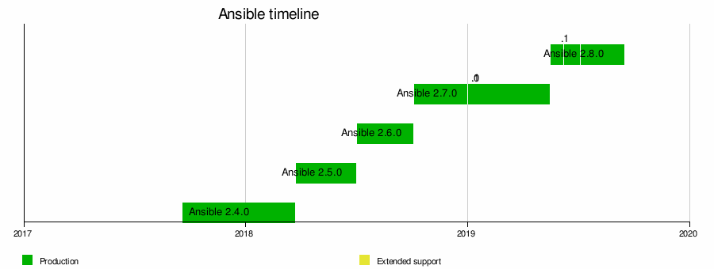

# Ansible

Ansible là 1 nền tảng tự động hóa mã nguồn mở, sử dụng cho các nhiệm vụ CNTT như triển khai phần mềm, quản lý cấu hình, điều phối dịch vụ cơ sở hạ tầng và cập nhật hệ thống. Gần như bất cứ điều gì mà quản trị viên hệ thống thực hiện hàng tuần hoặc hàng ngày.

Công cụ Ansible được phát triển bởi Michael DeHaan, tác giả của ứng dụng máy chủ cung cấp Cobbler và đồng tác giả của khuôn khổ Fedora Unified Network Controller (Func) để quản trị từ xa.

Ansible được viết bởi Michael DeHaan vào năm 2012 và được Red Hat mua lại vào năm 2015. Đến nay đã ra đời được 8 năm và phiên bản ổn định gần nhất được ra đời vào tháng 10 năm 2020

Một số 
### Cách Ansible hoạt động

Trong Ansible có 2 loại máy tính là `control node` và `managed nodes`. `Control node` là một máy tính chạy Ansible, phải có ít nhất 1 `control node`. `Managed node` là bất kỳ thiết bị nào đang được quản lý bởi `control node`.

Ansible hoạt động bằng cách kết nối các node trên mạng, sau đó gửi 1 chương trình nhỏ gọi là module ansible đến node đó.

Ansible thực thi các module qua SSH và xóa chúng khi hoàn tất. Yêu cầu duy nhất cho tương tác này là nút điều khiển Ansible của bạn có quyền truy cập đăng nhập vào các node được quản lý. SSh key là cách phổ biển nhất để cung cấp quyền truy cập, nhưng các hình thức xác thực khác cũng được hỗ trợ, truy nhiên nó có thể không an toàn khi giao tiếp qua mạng hoặc nguy cơ lộ mật khẩu trong file inventory.

### Ansible Versions

Mọi phiên bản Ansible được phát hành theo chu kỳ 4-6 tháng một lần tùy thuộc vào những thay đổi từ phiên bản này sang phiên bản khác.

### Ansible có free? 

Ansible là công cụ mã nguồn mở hoàn toàn miễn phí được sử dụng cho các mục đích trên. Tuy nhiên nó vẫn được sử dụng với mục đích thương mại

- Sử dụng ansible với CLI là miễn phí không giới hạn

- Ansible AWX (Ansible Web eXecutable) miễn phí

- Ansible Tower cung cấp việc xử lý lên đến 10 node, nếu muốn nhiều hơn thì phải trả phí. Ansible Tower cung cấp giao diện người dùng đồ họa gọn gàng với bảng điều khiển.

### Use Cases

#### Cấp phép (Provisioning)

Tự động hóa, quản lý và kết nối các giai đoạn vòng đời của 1 ứng dụng. Có thể hiểu đơn giản là thiết lập 1 máy chủ sẵn sàng để được quản lý.

`provision` -> `configure` -> `deploy` -> `manage`

Ansible có thể làm việc đa nền tảng, đa nhà cung cấp.

- Baremetal
Ansible kết hợp nhiều công cụ quản lý datacenter để gọi và thực hiện các bước cấp phép cần thiết
- Ảo hóa
- Mạng
- Lưu trữ
- Cloud

#### Quản lý cấu hình (Management configuration)

Quản lý hệ thống với các tập lệnh cấu hình nhất quán, cần ít người hơn và tốn ít thời gian hơn để duy trì. 

Các thành viên trong nhóm hoàn thành công việc nhanh hơn và có thời gian tham gia vào các công việc quan trọng hơn thay vì quản lý cấu hình. 

Mô hình tài nguyên hướng trạng thái mô tả trạng thái mong muốn của hệ thống. Bất kể hệ thống ở trạng thái nào, ansible hiểu cách chuyển nó sang trạng thái mong muốn 

Ansible dựa vào hệ thống quản lý cấu hình từ xa an toàn nhất hiện có làm lớp truyền tải mặc định của nó: OpenSSH

Tính năng Ansible trên hơn 1.300 mô-đun trong phân phối cốt lõi, cung cấp cơ sở tuyệt vời để xây dựng tự động hóa

#### Triển khai ứng dụng (App Deployment)

Triển khai ứng dụng nhất quán, tất cả đều từ 1 khuôn khổ chung. Thay vì viết các chương trình tự động hóa, ta chỉ cần viết các mô tả nhiệm vụ giản đơn. 

- Playbook 

    - Có thể lặp lại và tin cậy 
    - Đơn giản để viết và duy trì
    - Siêu linh hoạt 
    - Thư viện khổng lồ với hơn 1300 mô-đun

#### Phân phối liên tục (Continuous Delivery)

Xây dựng phần mềm theo cách "release early, release often" - "phát hành sớm, phát hành thường xuyên".

Thường xuyên cung cấp các bản cập nhật, chỉ yêu cầu sự can thiệp của con người khi cần thiết. 

Việc chia hàng nghìn máy chủ thành các nhóm có thể quản lý và cập nhật 100 máy chủ cùng một lúc là cực kỳ đơn giản

#### Tự động hóa bảo mật (Security Automation)

Tự động hóa tích hợp các giải pháp bảo mật khác nhau, điều tra và ứng phó với các mối đe dọa trong toàn hệ thống theo cách thống nhất.

#### Điều phối  (Orchestration)

Ansible : Công cụ có thể sắp xếp các nhiệm vụ phức tạp của mình 1 cách đơn giản

Xây dựng trật tự từ sự hỗn loạn 

Tập hợp những thứ khác nhau thành 1 thể thống nhất 

