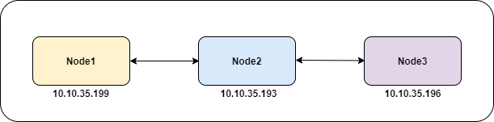

# Cấu hình elasticsearch cluster

## Mô hình: 



## Yêu cầu

Các node được cài sẵn elasticsearch

Các node đã tắt firewall

## Cấu hình

```
Số node master = 2N/(2 + 1)
Trong đó: N là tổng số node trong cluster
```

- Chỉnh sửa file cấu hình trên `node1`: 

```
cat >/etc/elasticsearch/elasticsearch.yml << EOF
cluster.name: node-test
node.name: node1
path.data: /var/lib/elasticsearch
path.logs: /var/log/elasticsearch
network.host: 0.0.0.0
http.port: 9200
discovery.seed_hosts: ["10.10.35.199", "10.10.35.193", "10.10.35.196"]
node.master: true
node.data: true
EOF
```

Trong đó: 

1. `cluster.name`: Là tên cluster, trên các node phải đặt giống nhau
2. `node.name`: Tên node (thường sẽ là hostname)
3. `node.data`: true => Node có thực hiện chứa data hay không, nếu node master đã có dữ liệu từ trước thì phải để luôn node master làm node chứa dữ liệu
4. `node.master`: true => Chỉ định node master
5. `discovery.seed_hosts: ["10.10.35.199", "10.10.35.193", "10.10.35.196"]` => Các node trong cluster

- Chỉnh sửa cấu hình trên `node2`: 

```
cat >/etc/elasticsearch/elasticsearch.yml << EOF
cluster.name: node-test
node.name: node2
path.data: /var/lib/elasticsearch
path.logs: /var/log/elasticsearch
network.host: 0.0.0.0
http.port: 9200
discovery.seed_hosts: ["10.10.35.199", "10.10.35.193", "10.10.35.196"]
node.master: false
node.data: true
EOF
```

- Chỉnh sửa cấu hình trên `node3`:

```
cat >/etc/elasticsearch/elasticsearch.yml << EOF
cluster.name: node-test
node.name: node3
path.data: /var/lib/elasticsearch
path.logs: /var/log/elasticsearch
network.host: 0.0.0.0
http.port: 9200
discovery.seed_hosts: ["10.10.35.199", "10.10.35.193", "10.10.35.196"]
node.master: true
node.data: true
EOF
```

- Thực hiện xóa data cũ trong các node: 

```
rm -rf /var/lib/elasticsearch/*
```

> đối với các node đã có dữ liệu nếu như cluster uuid không đồng nhất sẽ không join được cluster

- Restart lại elasticsearch trên tất cả các node:

```
systemctl restart elasticsearch
```

- Sau khi restart xong elasticsearch, kiểm tra cluster bằng cách trên node master gọi: 

```
curl http://localhost:9200/_cluster/health?pretty
```

kết quả: 

```
{
  "cluster_name" : "node-test",
  "status" : "green",
  "timed_out" : false,
  "number_of_nodes" : 3,
  "number_of_data_nodes" : 3,
  "active_primary_shards" : 1,
  "active_shards" : 2,
  "relocating_shards" : 0,
  "initializing_shards" : 0,
  "unassigned_shards" : 0,
  "delayed_unassigned_shards" : 0,
  "number_of_pending_tasks" : 0,
  "number_of_in_flight_fetch" : 0,
  "task_max_waiting_in_queue_millis" : 0,
  "active_shards_percent_as_number" : 100.0
}
```

- Kiểm tra chi tiết hơn bằng câu lệnh: 

```
  8  195k    8 16294    0     0   246k      0 --:--:-- --:--:-- --:--:--  244k{
  "cluster_name" : "node-test",
  "cluster_uuid" : "vCjhe9zSTKGtT_FRxCQ6gw",
  "version" : 49,
  "state_uuid" : "65Q-zXH8SOmE7qVzqcTnFA",
  "master_node" : "fi_OxgVsSNKxrV0kZ14nnw",
  "blocks" : { },
  "nodes" : {
    "6r3u3rZ8R0C_Wcyf8HCLFw" : {
      "name" : "node2",
      "ephemeral_id" : "T4IE5IMGTIqT9buc0qo5Pw",
      "transport_address" : "10.10.35.193:9300",
      "attributes" : {
        "ml.machine_memory" : "4136165376",
        "ml.max_open_jobs" : "20",
        "xpack.installed" : "true",
        "transform.node" : "true"
      }
    },
    "fi_OxgVsSNKxrV0kZ14nnw" : {
      "name" : "node3",
      "ephemeral_id" : "3TnpaFJaSm6j_F58DlNjdw",
      "transport_address" : "10.10.35.196:9300",
      "attributes" : {
        "ml.machine_memory" : "2096123904",
        "xpack.installed" : "true",
        "transform.node" : "true",
        "ml.max_open_jobs" : "20"
      }
    },
    "bMH1BIVNTZ6nx1Tj_lbQUQ" : {
      "name" : "node1",
      "ephemeral_id" : "Es_yQ0iATJe6y-KrYDi-HA",
      "transport_address" : "10.10.35.199:9300",
      "attributes" : {
        "ml.machine_memory" : "2096742400",
        "ml.max_open_jobs" : "20",
        "xpack.installed" : "true",
        "transform.node" : "true"
      }
    }
  },
:
```
Như vậy, ta đã cấu hình thành công elasticsearch cluster. 

