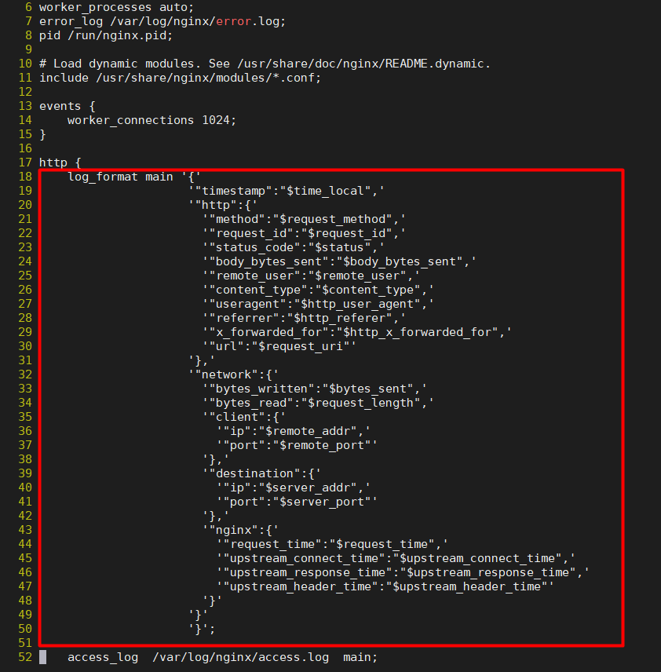
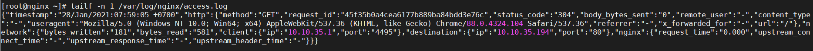

# Cấu hình định dạng json log trên nginx

Để chuyển  đổi định dạng log của nginx thành JSON, hãy thực hiện cú pháp sau: 

- Tiến hành backup file cấu hình nginx:

```
cp /etc/nginx/nginx.conf /etc/nginx/nginx.conf.bk
```

- Truy cập vào file `/etc/nginx/nginx.conf` và sửa cấu hình. Tại mục cấu hình `log_format`, hãy cấu hình như sau: 

```
log_format main '{'
                 '"timestamp":"$time_local",'
                 '"http":{'
                   '"method":"$request_method",'
                   '"request_id":"$request_id",'
                   '"status_code":"$status",'
                   '"body_bytes_sent":"$body_bytes_sent",'
                   '"remote_user":"$remote_user",'
                   '"content_type":"$content_type",'
                   '"useragent":"$http_user_agent",'
                   '"referrer":"$http_referer",'
                   '"x_forwarded_for":"$http_x_forwarded_for",'
                   '"url":"$request_uri"'
                 '},'
                 '"network":{'
                   '"bytes_written":"$bytes_sent",'
                   '"bytes_read":"$request_length",'
                   '"client":{'
                     '"ip":"$remote_addr",'
                     '"port":"$remote_port"'
                   '},'
                   '"destination":{'
                     '"ip":"$server_addr",'
                     '"port":"$server_port"'
                   '},'
                   '"nginx":{'
                     '"request_time":"$request_time",'
                     '"upstream_connect_time":"$upstream_connect_time",'
                     '"upstream_response_time":"$upstream_response_time",'
                     '"upstream_header_time":"$upstream_header_time"'
                   '}'
                 '}'
                 '}';
```

Khi sửa trong file sẽ như sau: 



- Kiểm tra lại cấu hình nginx và khởi động lại nginx:

```
nginx -t
nginx -s reload
```

- Kiểm tra access log của nginx: 

```
tailf -n 1 /var/log/nginx/access.log
```

