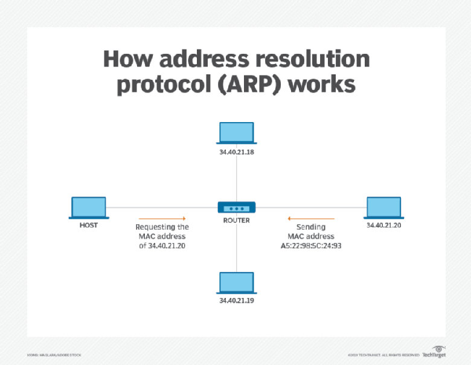

# Address Resolution Protocol - ARP 

Hầu hết các chương trình máy tính sử dụng địa chỉ IP để gửi/nhận tin nhắn. Tuy nhiên, việc truyền/nhận thực tế xảy ra qua địa chỉ vật lý(MAC). 

Tất cả các hệ điều hành trong mạng đều giữ một bộ nhó cache ARP. Mỗi khi một máy chủ yêu cầu địa chỉ MAC để gửi 1 gói tin đến một máy chủ khác trong mạng LAN, nó sẽ kiểm tra bộ nhớ cache ARP của nó để xem bản dịch địa chỉ IP sang MAC đã tồn tại hay chưa. Nếu có, thì không cần thực hiện yêu cầu mới. Nếu không tồn tại bản ghi giữa địa chỉ IP và địa chỉ MAC đó thì sẽ có 1 yêu cầu được đưa ra và ARP sẽ được thực hiện. 

ARP phát 1 yêu cầu tới tất cả các máy trong mạng LAN và hỏi xem có máy nào biết chúng đang sử dụng địa chỉ IP cụ thể đó không. Khi một máy nhận ra địa chỉ IP là của mình, nó sẽ gwuri trả lời để ARP cập nhật vào bộ nhớ cahe địa chỉ MAC ứng với địa chỉ IP đó để sử dụng cho tương lai và tiếp tục giao tiếp.

**Các keyword quan trọng liên quan đến ARP:**

- `ARP Cache`: Sau khi phân giải địa chỉ MAC, ARP sẽ gửi nó đến nguồn nơi nó lưu trữ trong một bảng để tham khảo trong tương lai. Các giao tiếp tiếp theo có thể sử dụng địa chỉ MAC từ bảng

- `ARP Cache Timeout`: Nó cho biết thời gian mà địa chỉ MAC trong bộ nhớ cache ARP có thể cư trú

- `ARP request`: Điều này không có gì khác ngoài việc phát một gói tin qua mạng để xác nhận xem chúng tôi có gặp địa chỉ MAC đích hay không. 

- `ARP response/reply`: Đây là phản hồi địa chỉ MAC mà nguồn nhận được từ đích hỗ trợ cho việc truyền dữ liệu thêm

