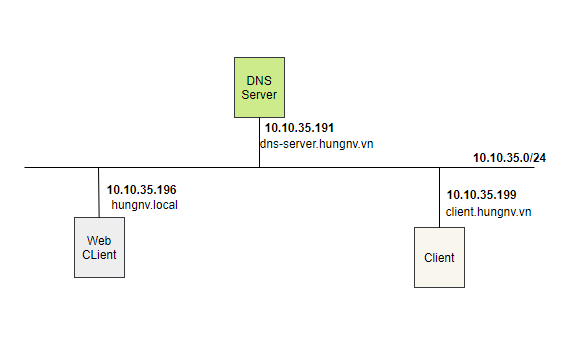
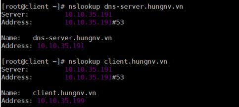
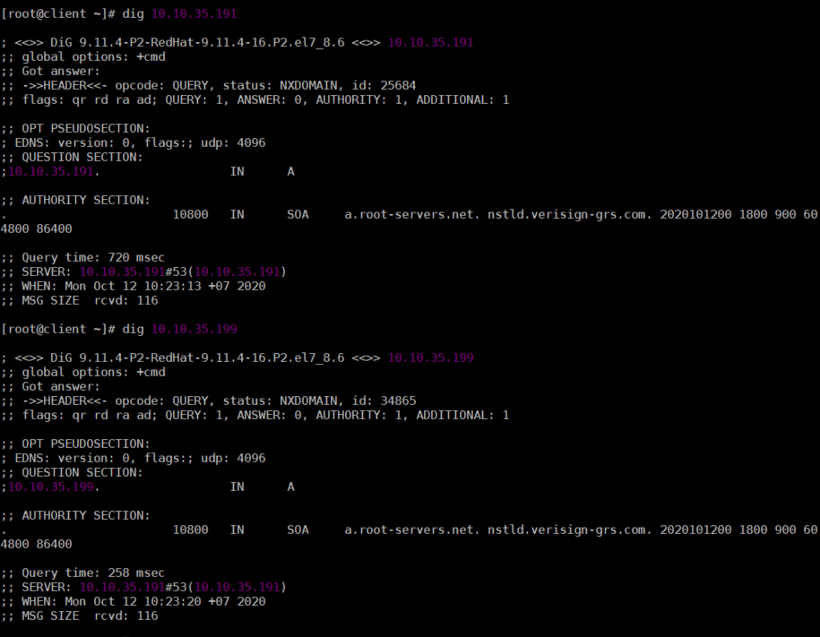
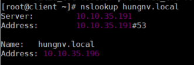

# Cài đặt DNS trên CentOS 7

Mô hình cài đặt: 



Thực hiện cấu hình với quyền root.

## Cài đặt trên DNS server

### 1. Cài đặt bind

```
yum install -y bind bind-utils
```
### Tạo bản ghi DNS

#### Tạo file forward zone

```
vi /var/named/forward.hung
```

File lưu trữ thông tin mối liên hệ giữa địa chỉ IP và Hostname. Thêm vào file nội dung như sau:

```
$TTL 86400
@   IN  SOA     dns-server.hungnv.vn. root.hungnv.vn. (
        2020100800  ;Serial
        3600        ;Refresh
        1800        ;Retry
        604800      ;Expire
        86400       ;Minimum TTL
)
@       IN  NS          dns-server.hungnv.vn.
@       IN  A           10.10.35.191
@       IN  A           10.10.35.199
dns-server       IN  A   10.10.35.191
client          IN  A   10.10.35.199
```

Trong đó:

- TTL: là viết tắt của Time-To-Live là khoảng thời gian(hoặc hops) mà gói tin tồn tại trên mạng trước khi bị router loại bỏ.
- IN: là Internet
- SOA: là viết tắt của Start of Authority. Về cơ bản nó xác định name server có thẩm quyền, trong trường hợp này là dns-server.hungnv.vn và thông tin liên lạc - dns-server.hungnv.vn
- NS: là viết tắt của Name Server
- A: là bản ghi A. Nó trỏ 1 domain/subdomain tới địa chỉ IP
- Serial: áp dụng cho mọi dữ liệu trong zone và có định dạng YYYYMMDDNN với YYYY là năm, MM là tháng, DD là ngày, NN là số lần sửa đổi dữ liệu zone trong ngày. Luôn luôn phải tăng số này lên mỗi lần sửa đổi dữ liệu zone. Khi Slave DNS Server liên lạc với Master DNS Server, trước tiên nó sẽ hỏi số serial. Nếu số serial của Slave nhỏ hơn số serial của máy Master tức là dữ liệu zone trên Slave đã cũ và sau đó Slave sẽ sao chép dữ liệu mới từ Master thay cho dữ liệu đang có.
- Refresh: chỉ ra khoảng thời gian Slave DNS Server kiểm tra dữ liệu zone trên Master để cập nhật nếu cần. Giá trị này thay đổi tùy theo tuần suất thay đổi dữ liệu trong zone.
- Retry: nếu Slave DNS Server không kết nối được với Master DNS Server theo thời hạn mô tả trong refresh (ví dụ Master DNS Server bị shutdown vào lúc đó thì Slave DNS Server phải tìm cách kết nối lại với Master DNS Server theo một chu kỳ thời gian mô tả trong retry. Thông thường, giá trị này nhỏ hơn giá trị refresh).
- Expire: nếu sau khoảng thời gian này mà Slave DNS Server không kết nối được với Master DNS Server thì dữ liệu zone trên Slave sẽ bị quá hạn. Khi dữ liệu trên Slave bị quá hạn thì máy chủ này sẽ không trả lời mỗi truy vấn về zone này nữa. Giá trị expire này phải lớn hơn giá trị refresh và giá trị retry.
- Minimum TTL: chịu trách nhiệm thiết lập TTL tối thiểu cho 1 zone
- MX: đây là bản ghi Mail exchanger. Nó chỉ định server nhận và gửi mail
- CNAME: Là viết tắt của Canonical Name - tên miền chính. Nó sẽ map alias domain(tên miền phụ) tới tên miền khác.
- PTR: là viết tắt của Pointer. Thuộc tính này phân giải địa chỉ IP thành domain.

#### Tạo file reverse zone

```
vi /var/named/reverse.hung
```
Sau đó thêm vào file nội dung như sau:

```
$TTL 86400
@   IN  SOA    dns-server.hungnv.vn. root.hungnv.vn. (
        2020100800  ;Serial
        3600        ;Refresh
        1800        ;Retry
        604800      ;Expire
        86400       ;Minimum TTL
)
@       IN  NS          dns-server.hungnv.vn.
@       IN  PTR         hungnv.vn
dns-server       IN  A   10.10.35.191
client          IN  A   10.10.35.199
191     IN  PTR         dns-server.hungnv.vn.
199     IN  PTR         client.hungnv.vn.
```

#### Phân quyền cho các file zone

```
chgrp named /var/named/forward.hung
chgrp named /var/named/reverse.hung
```

### Chỉnh sửa trên file cấu hình `named.conf`

- Backup file cấu hình 

```
cp /etc/named.conf /etc/named.bak
```

Chỉ định nơi lưu các file cấu hình các zone như sau:

- Thêm vào cuối file nội dung như sau:

```
//forward zone
zone "hungnv.vn" IN {
type master;
file "forward.hung";
allow-update { none; };
};

//reverse zone
zone "35.10.10.in-addr.arpa" IN {
type master;
file "reverse.hung";
allow-update { none; };
};
```

**Trong đó:**

`type`: Quy định vai trò của server cho một zone(khu vực) cụ thể. Thuộc tính master cho biết đây là 1 server có thẩm quyền.

`file`: chứa thông tin về file forward/reverse zone của domain. Có thể để đường dẫn tương đối hoặc tuyệt đối.

`allow-update`: Thuộc tính này xác định các host system có được phép chuyển tiếp cập nhật DNS động. Trong trường hợp này là không.

- Chỉnh sửa Options

Thêm các địa chỉ IP của DNS server vào phần `listen-on port` và dải địa chỉ của dns vào allow-query.

```
listen-on port 53 { 127.0.0.1; 10.10.35.191; };
allow-query     { localhost; 10.10.35.0/24; };
```

Phần Option trong file sẽ trông như sau: 


### Kiểm tra cấu hình và bật dịch vụ 

- Kiểm tra các cấu hình

```
named-checkconf
named-checkzone hungnv.vn /var/named/forward.hung
named-checkzone hungnv.vn /var/named/reverse.hung
```


- Khởi động dịch vụ named

```
systemctl start named
systemctl enable named
systemctl status named
```

## Phía Client 

### Trỏ đến dns server

Trong file cấu hình card mạng, thêm địa chỉ DNS đang dùng bằng địa chỉ DNS server vừa cấu hình: 

```
vi /etc/sysconfig/network-scripts/ifcfg-eth0
```

Sau đó trỏ đến địa chỉ DNS server

```
DNS1=10.10.35.191
```

Khởi động lại cài đặt mạng 

```
systemctl restart network
```

sau đó kiểm tra trong file `resolv.conf`. 

```
cat /etc/resolv.conf
```
```
# Generated by NetworkManager
search hungnv.vn
nameserver 10.10.35.191
```

### Kiểm tra hoạt động của DNS server

- Cài đặt nslookup 

```
yum install -y bind-utils
```

- Kiểm tra các bản ghi 

```
nslookup dns-server.hungnv.vn
nslookup client.hungnv.vn
```




Sử dụng lệnh dig để xem chi tiết hơn các bản ghi. 

```
dig 10.10.35.191
dig 10.10.35.199
```



Như vậy ta đã cài đặt thành công mô hình client server cho DNS. Bây giờ ta sẽ thêm 1 bản ghi A trên DNS server để trỏ cho web client. 

## Thêm 1 bản ghi A vào DNS server. 

Mình sẽ thêm 1 bản ghi a với tên miền là hungnv.local và địa chỉ IP là 10.10.35.196 cho web server. Để có thể truy cập được web thông qua tên miền hungnv.local

Tạo 1 file forward : 

```
vi /var/named/hungnv.local.fwd
```

Sau đó ghi vào file nội dung như sau: 

```
$TTL 86400
@   IN  SOA     dns-server.hungnv.vn. root.hungnv.local. (
        2020100800  ;Serial
        3600        ;Refresh
        1800        ;Retry
        604800      ;Expire
        86400       ;Minimum TTL
)
@       IN  NS          dns-server.hungnv.vn.
@       IN  A           10.10.35.196
```

- Thay `dns-server.hungnv.vn` bằng name server của bạn. 
- Thay `hungnv.local` và `10.10.35.196` lần lượt là tên miền và địa chỉ IP của bạn. 

Sau khi lưu lại file, truy cập tiếp vào file `/etc/named.conf` và thêm vào cuối file nội dung sau: 

Ta chỉ ra file cấu hình forward zone vừa tạo cho bản ghi A. 
```
//forward zone
zone "hungnv.local" IN {
type master;
file "hungnv.local.fwd";
allow-update { none; };
};
```

Lưu lại file và tiến hành khởi động lại named. 

```
systemctl restart named
systemctl status named
```

### Truy cập client để kiểm tra truy cập tới web client bằng tên miền. 

Sử dụng nslookup để kiểm tra bản ghi. 



Ta thấy rằng tên miền hungnv.local đã được gán cho địa chỉ 10.10.35.196

Bây giờ tiến hành curl đến trang web để kiểm tra hoạt động của tên miền. 

```
curl -I hungnv.local
```


Như vậy, đã có thể truy cập web với địa chỉ `10.10.35.196` bằng tên miền `hungnv.local`. 


