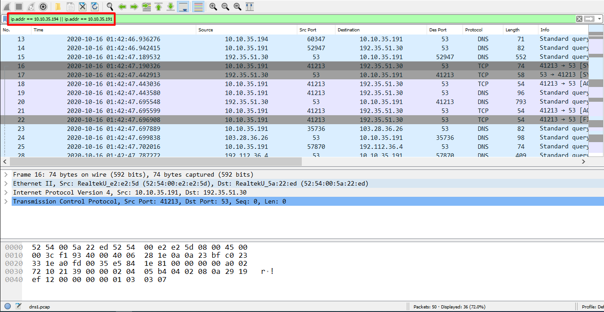
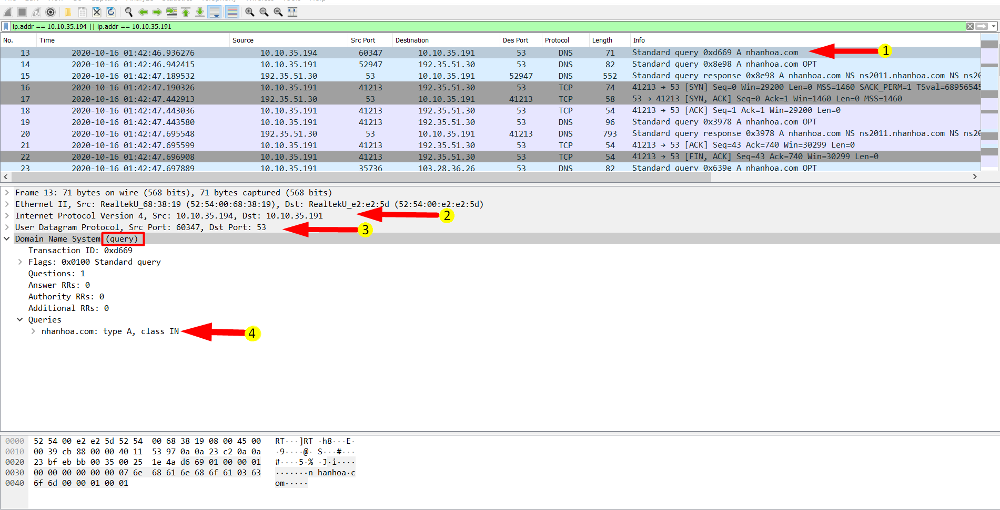
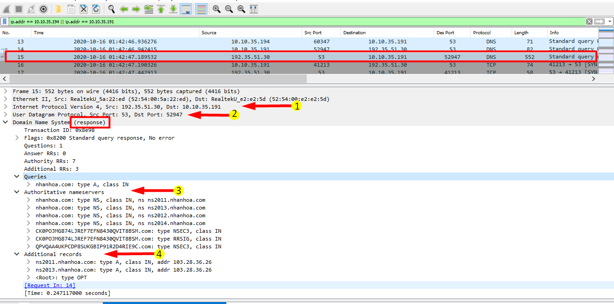
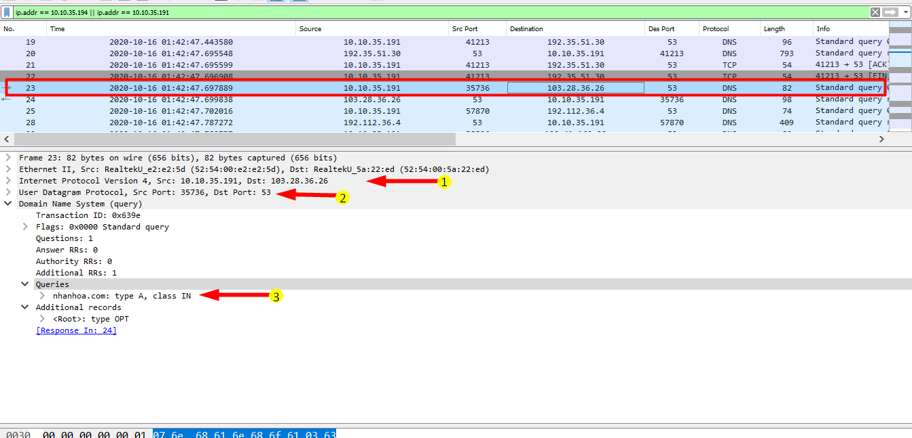
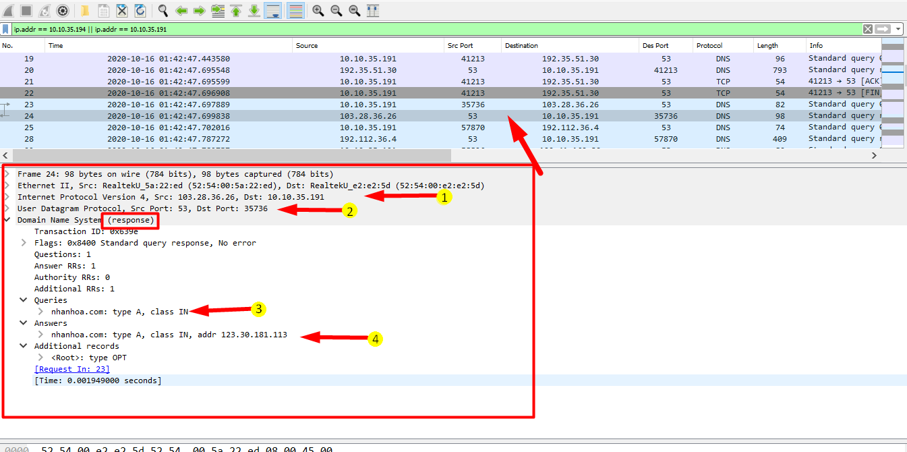

# Sử dụng wireshark xem đường đi gói tin DNS

Ở bài này, mình sẽ bắt các gói tin ở phía DNS server để xem cách DNS tra cứu thông tin bản ghi. 

Cú pháp bắt gói tin mình sử dụng để bắt các traffic dns như sau: 

```
tcpdump -ni <interface> port 53 -c50 -w dns1.pcap
```
Mình sẽ sử dụng traffic mình đã bắt sẵn [tại đây](https://github.com/hungviet99/thuc_tap/blob/master/Wireshark/Traffic/dns1.pcap)

Mình có 1 DNS client với IP là `10.10.35.194` và dns server với IP là `10.10.35.191`, mình sẽ sử dụng filter để lọc các gói tin liên quan đến 2 ip này. 

```
ip.addr == 10.10.35.194 || ip.addr == 10.10.35.191
```



Ta xem gói tin đầu tiên hiển thị sau khi filter (gói tin với số thứ tự 13)



Các thông tin trên gói tin chỉ ra rằng, đây là gói tin query bản ghi A của tên miền `nhanhoa.com` với: 

2. Địa chỉ IP nguồn là `10.10.35.194` gửi yêu cầu tới DNS server qua với địa chỉ `10.10.35.191`

3. Sử dụng UDP, port nguồn là `60347` và port đích là `53`.

4. Đây là gói tin query bản ghi A cho tên miền `nhanhoa.com`

Thời gian bắt đầu truy vấn là `01:42:46.936276` 

Tiếp theo ta xem gói tin với số thứ tự 14.


Ta thâý rằng gói tin này là gói tin query từ DNS server tới 1 máy chủ có thẩm quyền bên ngoài. Tức là sau khi nhận được yêu cầu bản ghi A từ Client, DNS server kiểm tra không thấy lưu thông tin về bản ghi này thì nó liền gửi 1 yêu cầu về thông tin bản ghi A của tên miền nhanhoa.com cho 1 máy chủ root. 

1.  Gói tin của dns server có địa chỉ `10.10.35.191` gửi tới máy chủ root có địa chỉ `192.35.51.30` 

2. Sử dụng giao thức UDP, port nguồn là `52947` và port đich là `53`.

3. Đây là gói tin query bản ghi A của tên miền nhanhoa.com.

Thời gian bắt đầu truy vấn là `01:42:46.942415`

Gói tin tiếp theo (gói tin số 15)

Đây là gói tin trả lời truy vấn từ root cho dns server rằng máy chủ DNS server có thể đến các máy chủ có thẩm quyền được liệt kê để hỏi. 



1. Gói tin được gửi từ máy chủ root có địa chỉ IP `192.35.51.30` gửi tới dns server có địa chỉ `10.10.35.191`. 

2. port nguồn là `53` và port đích là `52947`

3. Đây là gói tin trả lời cho dns server biết danh sách các máy chủ có thẩm quyền 

4. Bản ghi A record của các máy chủ có thẩm quyền. 

- Thời gian gói tin gửi đến lúc `01:42:47.189532`

Tiếp theo, ta xem các gói tin 23. 

Sau có đầy đủ thông tin về các máy chủ có thẩm quyền, DNS server sẽ tiến hành hỏi máy chủ đó về thông tin bản ghi cho tên miền `nhanhoa.com`. 



1. Gói tin query được gửi từ dns server đến địa chỉ `103.28.36.26`- 1 trong những địa chỉ mà root gửi về cho dns server yêu cầu bản ghi A của tên miền `nhanhoa.com`

2. Port nguồn là 35736 và port đích là 53. 

3. Gói tin query tới máy chủ có thẩm quyền yêu cần bản ghi A record của tên miền `nhanhoa.com`

Gói tin số 24, là gói tin được gửi từ địa chỉ của máy chủ có thẩm quyền

Có thể thấy, gói tin này là gói tin trả về thông tin địa chỉ IP của tên miền `nhanhoa.com`. 



Từ các thông tin có thể thấy 

1.  Gói tin được gửi từ địa chỉ `103.28.36.26` đến dns server có địa chỉ 10.10.35.191

2. Port nguồn là 53 và port đích là 35736

3. Đây là gói tin response trả về thông tin bản ghi A của tên miền `nhanhoa.com`

4. Tên miền `nhanhoa.com` được  gắn với địa chỉ `123.30.181.113`.

- Thời gian gói tin tới là `01:42:47.699838`

Từ đây ta có thể thấy rằng quy trình truy vấn 1 bản ghi DNS đã giống với quy trình được mô tả trong định nghĩa. Thời gian từ khi phía client yêu cầu bản ghi A record cho đến khi có được kết quả của bản ghi là khoảng 0,7s. 


