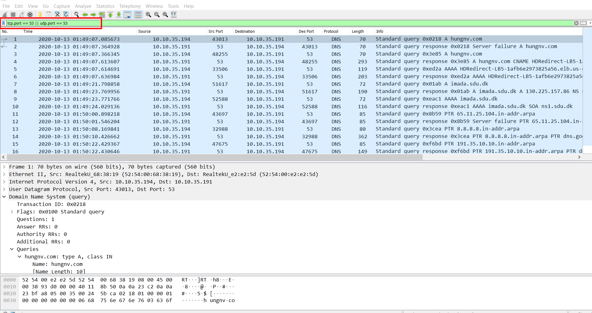
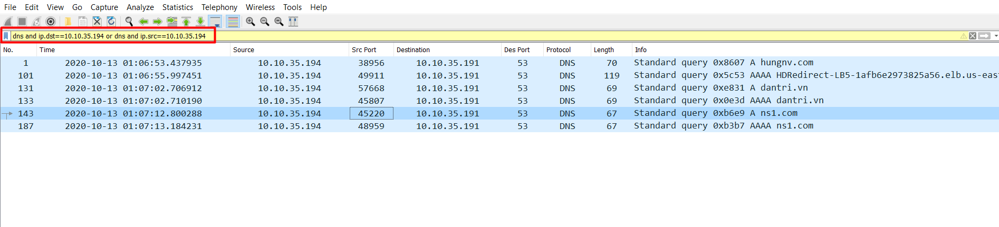
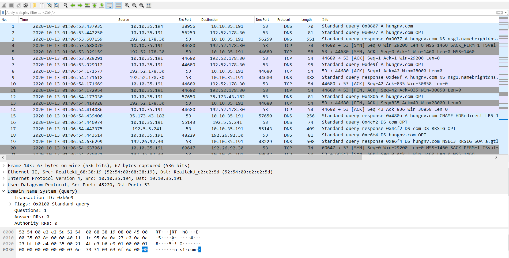
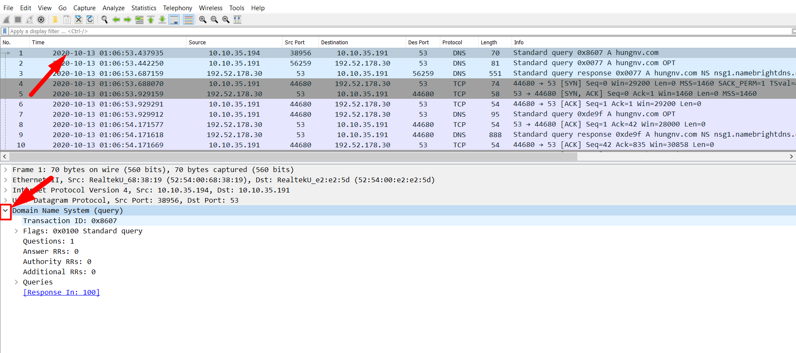
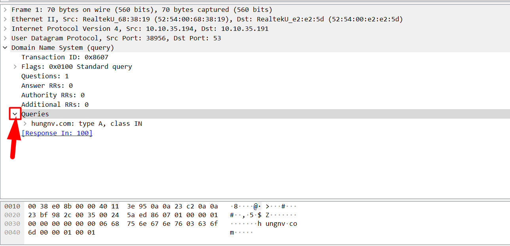
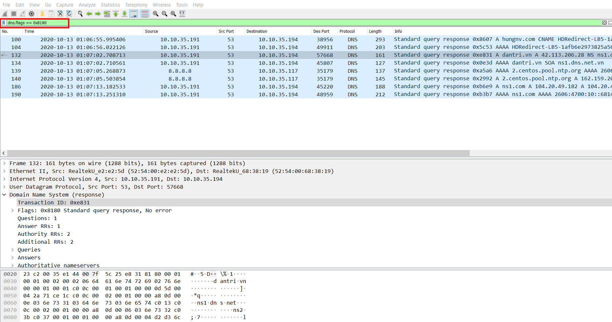
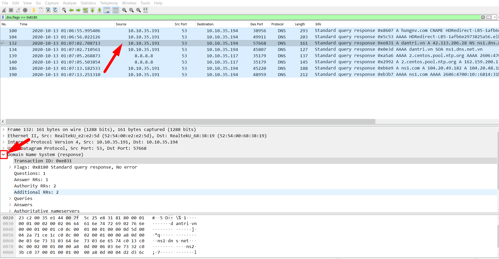

# Wireshark DNS

## Tracing DNS with Wireshark 

Sử dụng nslookup để bắt các bản ghi DNS, đồng thời sử dụng tcpdump để bắt các gói tin DNS. 

```
tcpdump -ni <interface> port 53 -c20 -w dns.pcap
```

sau khi bắt được các gói tin DNS, ta sử dụng wireshark để phân tích các gói tin. 

Sử dụng filter để lọc các gói tin dns: 

Lọc các gói tin có port là 53.



Lọc các gói tin dns có nguồn và đích chỉ định 



Ta thấy rằng các gói tin DNS thường sử dụng udp để truyền là chủ yếu nhưng TCP cũng khá thường xuyên được sử dụng nếu gói tin vượt quá 512byte. 



Tiếp theo, ta sẽ thử xem gói tin của dns. Kích vào gói tin đầu tiên, sau đó chọn `Domain Name System` để xem chi tiết gói tin. 



Chọn `Queries`, ta thấy rằng đây là 1 truy vấn bản ghi A cho tên miền `hungnv.com`.



Ta sẽ xem thêm 1 bản ghi response của dns. Sử dụng filter là `dns.flags == 0x8180`. 



Chọn 1 gói tin respon và chọn để xem chi tiết DNS response



Kích chọn mục `Answers` để xem trả lời. Ta thấy rằng với tên miền `dantri.vn`, dns server trả về địa chỉ IP là `42.113.206.28`


Để xem thêm về các filter với DNS, có thể truy cập [Tại đây](https://www.wireshark.org/docs/dfref/d/dns.html).


