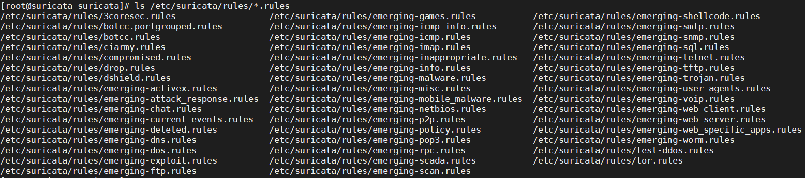

# Cấu hình tự động tải và update rule

Ta có thể tải xuống và cài đặt các quy tắc theo cách thủ công, nhưng có 1 cách dễ dàng và nhanh chóng hơn, có là đã có những chương trình hỗ trợ ta việc tải xuống và cài đặt các quy tắc. Ví dụ như  `Pulled Pork` và `Oinkmaster`. 
Trong bài viết này mình sử dụng `Oinkmaster` để tự động tải và update rule. 

### Cài đặt Oinkmaster 

Tải xuống gói cài đặt từ nguồn và cài đặt Oinkmaster

```
yum install perl
wget http://nchc.dl.sourceforge.net/project/oinkmaster/oinkmaster/2.0/oinkmaster-2.0.tar.gz
tar zxvf oinkmaster-2.0.tar.gz
cd oinkmaster-2.0
cp oinkmaster.pl /usr/local/bin/
chmod +x /usr/local/bin/oinkmaster.pl
cp oinkmaster.conf /etc/suricata/
```

### Chỉnh sửa file onikmaster.conf

- Mở file `oinkmaster.conf`

```
vi /etc/suricata/oinkmaster.conf
```

Sau đó thêm vào cuối file nội dung như sau: 

```
url = http://rules.emergingthreats.net/open/suricata/emerging.rules.tar.gz
```
Đây chính là đường dẫn để oinkmaster lấy các rule có sẵn. 

Lưu lại file sau đó chạy lệnh sau để onink cập nhật các rule vào thư mục  `/etc/suricata/rules`. 

```
oinkmaster.pl -C /etc/suricata/oinkmaster.conf -o /etc/suricata/rules
```

sau đó kiếm tra các file chứa rule đã được cập nhật hay chưa: 

```
ls /etc/sicata/rules/*.rules
```



Khi các rule đã được cập nhật, ta khai báo các file rule mà ta muốn sử dụng vào file `/etc/suricata/suricata.yaml`. 

Mở file và khai báo các file chứa rule tại `rule-file`. 

```
default-rule-path: /etc/suricata/rules
rule-files:
 - emerging-dos.rules
 - emerging-icmp.rules
```

Để tự động update các rule, ta sẽ đưa lệnh vào crontab và cho nó chạy định kỳ. 

```
crontab -e
```

sau đó ghi đoạn sau vào crontab.

```
0 0 * * sun oinkmaster.pl -C /etc/suricata/oinkmaster.conf -o /etc/suricata/rules
```
>vào mỗi 0h chủ nhật hàng tuần sẽ thực hiện update các rule.

Lưu lại vào thoát. 