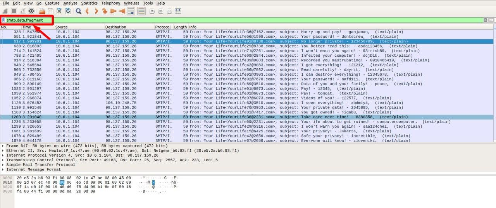
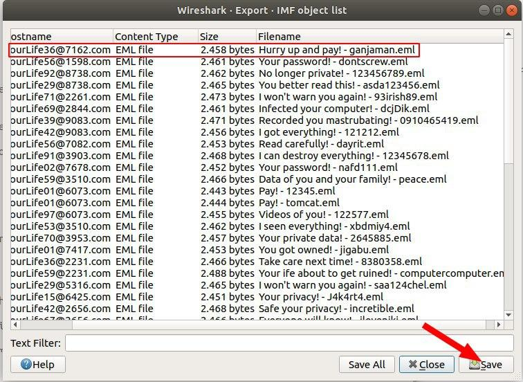

# Sử dụng wireshark để  trích xuất các đối tượng từ PCAP

Cảnh báo: Hầu hết các pcaps này đều chứa phần mềm độc hại Windows và hướng dẫn này liên quan đến việc kiểm tra các tệp độc hại này. Vì các tệp này là phần mềm độc hại của Windows, tôi khuyên bạn nên thực hiện hướng dẫn này trong môi trường không phải Windows, như máy chủ lưu trữ MacBook hoặc Linux. Bạn cũng có thể sử dụng một máy ảo (VM) chạy Linux.

Hướng dẫn này bao gồm các lĩnh vực sau:

- Xuất các đối tượng từ traffic HTTP
- Xuất các đối tượng từ traffic SMB
- Xuất email từ traffic SMTP
- Xuất tệp từ traffic FTP

Các traffic được sử dụng có thể tải về [tại đây](https://www.malware-traffic-analysis.net/training/exporting-objects.html).

## Xuất đối tượng từ traffic HTTP

Tải về  lưu lượng `extracting-objects-from-pcap-example-01.pcap.zip`. Mở bằng wireshard sau khi giaỉ nén. 

Sử dụng trường filter là `http.request`


Sau khi lọc trên http.request , hãy tìm hai yêu cầu GET tới smart-fax [.] Com . Yêu cầu đầu tiên kết thúc bằng .doc , cho biết yêu cầu đầu tiên trả về tài liệu Microsoft Word. Yêu cầu thứ hai kết thúc bằng .exe , cho biết yêu cầu thứ hai trả về tệp thực thi Windows. Các yêu cầu HTTP GET được liệt kê bên dưới.

- `smart-fax . com` - GET /Documents/Invoice&MSO-Request.doc
- `smart-fax . com` - GET /knr.exe

Có thể xuất các đối tượngtrên từ danh sách đối tượng HTTP bằng cách sử dụng đường dẫn menu: `File` -> `Export Objects` -> `HTTP`. 


Sau khi vào Object list, ta tiến hành lưu lại 2 object `smart-fax . com`. 


Sau khi lưu lại các file, sử dụng lệnh `file` để đọc thông tin loại tệp của 2 tệp vừa lưu. 

```
file Invoice&MSO-Request.doc
```


```
file knr.exe
```


Sau khi kiểm tra ta thấy đây là 1 tài liệu Microsoft Office Word và 1 file thực thi trên windows. 

Tiếp theo ta sẽ băm file và đưa đoạn hash lên virustotal để kiếm tra xem các tệp nghi ngờ này có bị phát hiện là phần mềm độc hại hay không. 

Sử dụng sha256 để băm 2 file trên. 


Sau khi băm ta được 2 đoạn băm cho Invoice&MSO-Request.doc và knr.exe lần lượt như sau: 

```
f808229aa516ba134889f81cd699b8d246d46d796b55e13bee87435889a054fb
```

```
749e161661290e8a2d190b1a66469744127bc25bf46e5d0c6f2e835f4b92db18
```

tiếp theo ta sẽ sử dụng [virustotal](https://www.virustotal.com/) để kiểm tra xem các file có bị phát hiện là phần mềm độc hại hay không. 

Dưới đây là kết quả khi kiểm tra của file `Invoice&MSO-Request.doc`, phát hiện có 38 công cụ phát hiện ra tệp này. 


Tiếp theo là kết quả kiểm tra của file `knr.exe` cũng cho thấy kết quả tương tự, có 48 công cụ phát hiện được tệp này. 


Ngaoì việc trích xuất các file độc hại, wireshard cũng có thể trích xuất ra các trang web. 

Sử dụng `extract-objects-from-pcap-example-02.pcap` để có thể trích xuất và thấy được 1 trang web giả mạo paypal để lừa đảo. 

Đầu tiên ta export ra các đối tượng HTTP. 

Sau đó, nếu muốn xem giao diện của trang web lừa đảo, chọn text/html và chọn `save` để lưu lại trang web.


Tiếp đó, mở bằng trình duyệt web để thấy được giao diện của trang web. 


## Xuất ra các tệp từ traffic FTP 

Phần lab này ta sẽ sử dụng `extract-objects-from-pcap-example-05.pcap`

Sử dụng filter là `ftp.request.command` để lọc ra các lệnh FTP. 


Sau khi lọc ra các lệnh FTP, ta có thể thấy có 5 file thực thi ta cần phải chú ý đó là `q.exe`,  `w.exe`, `e.exe`, `r.exe`, `t.exe`. 

Bây giờ ta sử dụng bộ lọc dữ liệu `ftp-data` để xem lại lưu lượng truy cập từ kênh dữ liệu FTP. 


Lần lượt sử dụng TCP stream để lưu lại các file dữ liệu dứoi dạng raw. Sau đó sử dụng sha256 để băm các file. 


Lần lượt ta thu được các file đã băm như sau : 

```
ca34b0926cdc3242bbfad1c4a0b42cc2750d90db9a272d92cfb6cb7034d2a3bd  q.exe

08eb941447078ef2c6ad8d91bb2f52256c09657ecd3d5344023edccf7291e9fc  w.exe

32e1b3732cd779af1bf7730d0ec8a7a87a084319f6a0870dc7362a15ddbd3199  e.exe

4ebd58007ee933a0a8348aee2922904a7110b7fb6a316b1c7fb2c6677e613884  r.exe

10ce4b79180a2ddd924fdc95951d968191af2ee3b7dfc96dd6a5714dbeae613a  t.exe
```

Sau đó lần lượt sử dụng các file đã băm đem tìm kiếm trên virustotal để xem có phát hiện được mối nguy hại liên quan đến các file này hay không. 


Như vậy ta thấy răng tất cả các file được phát hiện đều có thể là 1 phần mềm độc hại. 

## Traffic SMTP

Sử dụng `extract-objects-from-pcap-example-04.pcap` cho phần lab này. 

Một số loại phần mềm độc hại được thiết kế để biến một máy chủ Windows bị nhiễm thành một spambot. Những spam bots này gửi hàng trăm tin nhắn rác hoặc email độc hại mỗi phút. Trong một số trường hợp, các tin nhắn được gửi bằng SMTP không được mã hóa và ta có thể xuất các tin nhắn này từ một pcap của lưu lượng lây nhiễm.

Sử dụng filter `smtp.data.fragment` ta sẽ thấy các gói tin có subject. 



Tiếp đó, sử dụng `Export Objects` -> `IMF` để xem các đối tượng IMF. Tại đây, ta thấy tất cả tin nhắn đều được liệt kê với phần mở rộng là eml. Tiến hành lưu lại 1 trong các đối tượng dứoi dạng file eml. 



Mở file và xem nội dụng của email. 


**Tài liệu tham khảo**

https://unit42.paloaltonetworks.com/using-wireshark-exporting-objects-from-a-pcap/
