# Sử dụng wireshark để phân tích gói tin 

## Bắt đầu 

Giao diện khi bắt gói tin có 3 phần sau : 

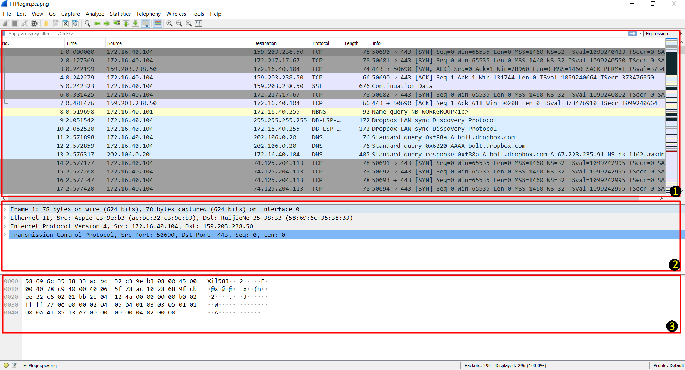

1. Packet List : Ở đây hiển thị các gói tin bắt được trên 1 card mạng, ở phần này mỗi gói tin là 1 dòng. Các gói tin được đánh số theo thứ tự lớn dần từ trên xuống dưới. 

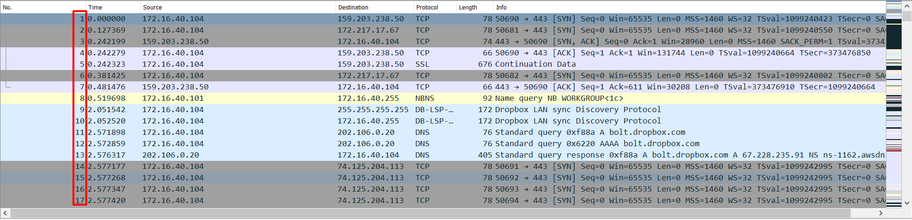

2. Packet Details : Ở phần này mục đầu tiên cho biết dung lượng gói tin, mục thứ 2 cho biết các địa chỉ MAC, mục thứ 3 cho biết địa chỉ IP nguồn và đích, mục thứ 4 cho biết giao thức TCP port hoặc UDP port. 

3. Packet Bytes : Hiển thị dữ liệu dưới dạng hệ cơ số 16 và ASCII. 

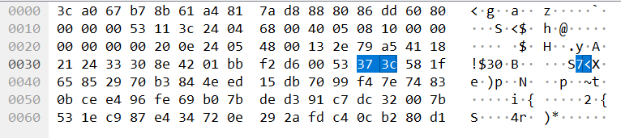

## Tìm mật khẩu FTP 

Tải về file [FTPlogin.pcapng](../traffic/FTPlogin.pcapng). Sau đó mở file `FTPlogin.pcapng` bằng wireshark và làm như sau: 

Nhập vào ở mục filter nhập vào ftp để lọc ra các gói tin sử dụng giao thức ftp 

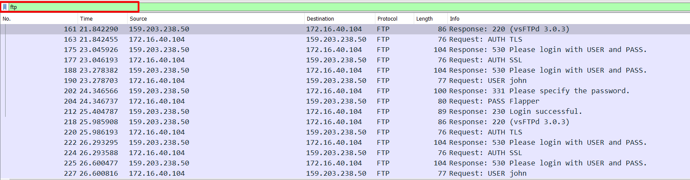

Khi lọc ra các gói tin sử dụng ftp, ta có thể dễ dàng thấy được tài khoản và mật khẩu FTP. 

## Tìm mật khẩu http 

Tải về file [httpLogin.pcapng](../traffic/httpLogin.pcapng). Sau đó mở file `httpLogin.pcapng` bằng wireshark và làm như sau: 

Sử dụng filter để lọc ra các gói tin sử dụng giao thức http 

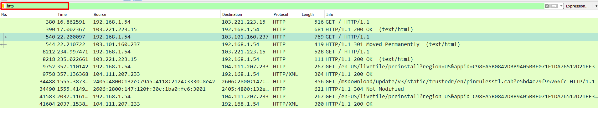

Sau đó kích vào gói tin như hình sau : 

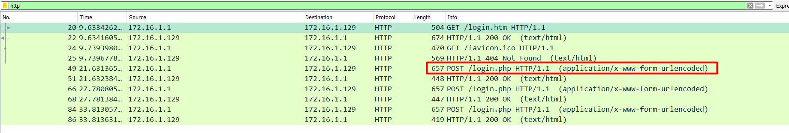

sau khi kích vào gói tin, hãy nhìn xuống mục `Packet Details` và kích vào dòng thứ 6 đó chính là phần form điền tài khoản và mật khẩu trên web. 

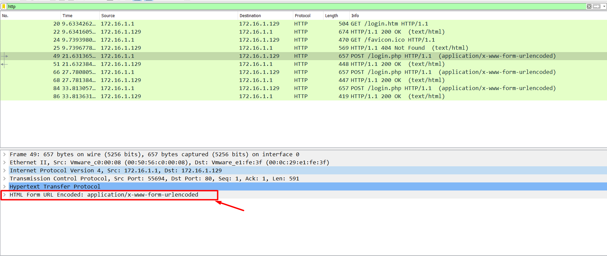

Sau khi kích vào form, toàn bộ thông tin về tài khoản và mật khẩu đã hiện ra. Ta có thể dễ dàng thấy rằng user đăng nhập là `Isaac` và mật khẩu đăng nhập là `Flapper`

nhưng đó chỉ là các tài khoản và mật khẩu người dùng đã nhập vào chưa chắc đã là tài khoản dùng để đăng nhập. Ta xét tiếp các gói tin ngay sau gói tin đó, chứa status code là 200. Sau đó kích vào `Line-based` để xem chi tiết. 

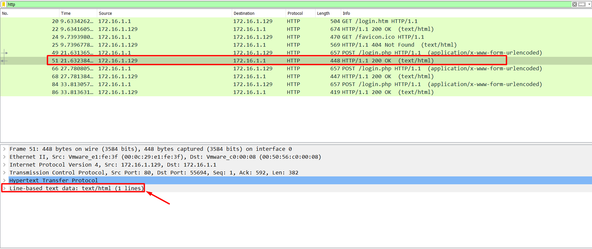

Sau khi kích vào `Line-based` ta thấy rằng đây là thông báo đăng nhập không chính xác. Như vậy là người dùng đã nhập sai tài khoản mật khẩu. Tiếp theo ta kiểm tra các gói tin tiếp theo để tìm kiếm gói tin chứa tài khoản và mật khẩu người dùng nhập chính xác. 

Tiếp theo ta thấy gói tin số 66 cũng là gói tin chứa thông tin đăng nhập khi người dùng nhập vào form đăng nhập

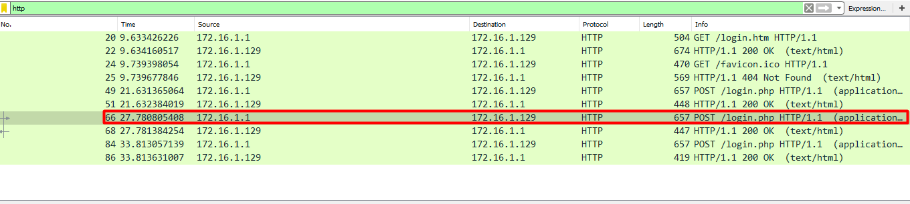

Ta xem gói tin sau đó là gói tin số `68` cho biết đây cũng là thông tin đăng nhập không chính xác. 

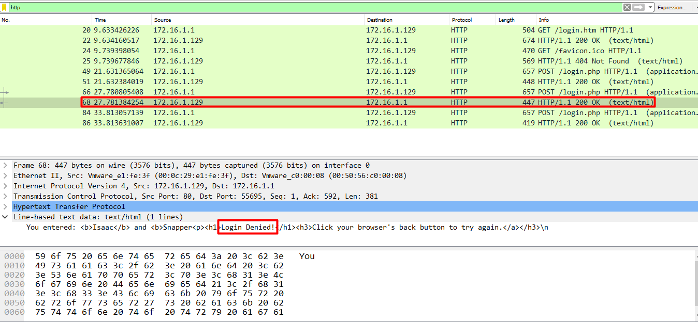

Chuyển sang gói tin số 84, ta sẽ thấy thông tin đăng nhập người dùng nhập vào như sau: 

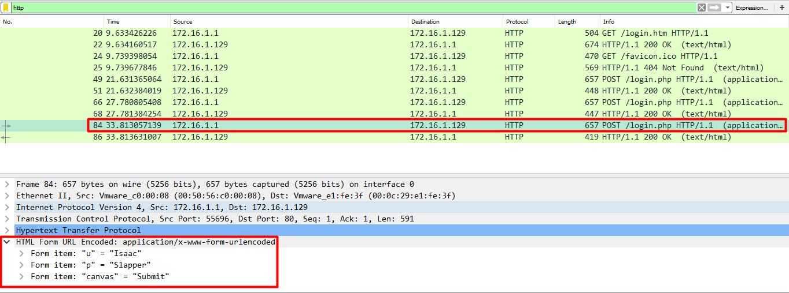

Kiểm tra gói tin chứa mã trạng thái, gói tin số  `86` thì ta thấy rằng thông tin đăng nhập đã được chấp thuận. Tức là người dùng sau nhiều lần thử đã đăng nhập thành công bằng user `Isaac` và password `Slapper`. 

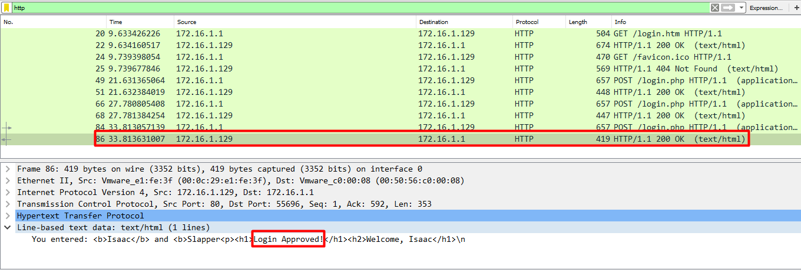

### Tìm mật khẩu HTTP Basic Authentication

HTTP Basic Authen sử dụng Base64 để mã hóa mật khẩu trước khi truyền đi. Điều này không khác gì nhiều so với truyền đi 1 đoạn text thông thường vì wireshark sẽ tự động giải mã nó. 

Tải xuống file [BasicLogin.pcap](../traffic/BasicLogin.pcapng) để thực hành phần này. 

Mở file `BasicLogin.pcapng` và sử dụng filter để lọc ra các gói tin sử dụng giao thức HTTP, sẽ được kết quả như dưới đây

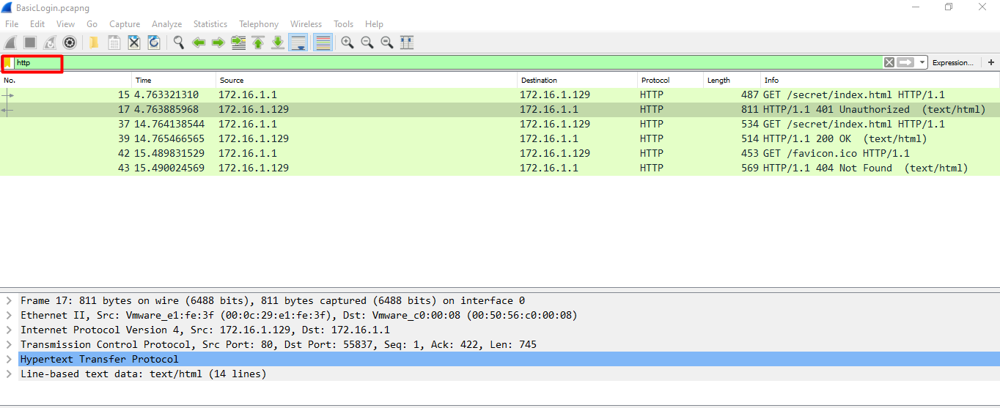

Từ các gói tin trên, ta thấy rằng gói tin số `17` có mã là 401 tức là yêu cầu phải đăng nhập trước khi truy cập web. 

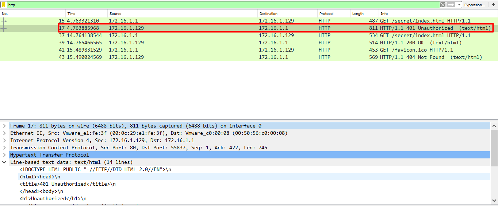

Để tìm mật khẩu mà người dùng sử dụng để đăng nhập vào, ta xem gói tin tiếp theo, gói tin số `37` : 

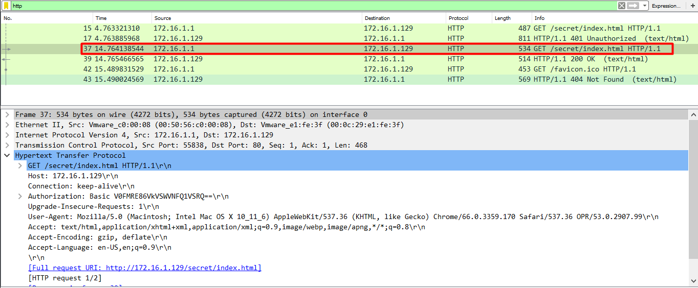

Tiếp theo kích vào giao thức HTTP 

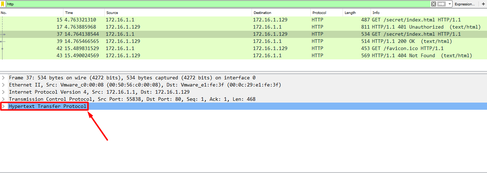

Ta thấy rằng có 2 trường là `GET` và `Authorization`, ta muốn xem mật khẩu đăng nhập `HTTP Basic Authentication` của `WALDO` nên ta sẽ kích vào `Authorization`. 

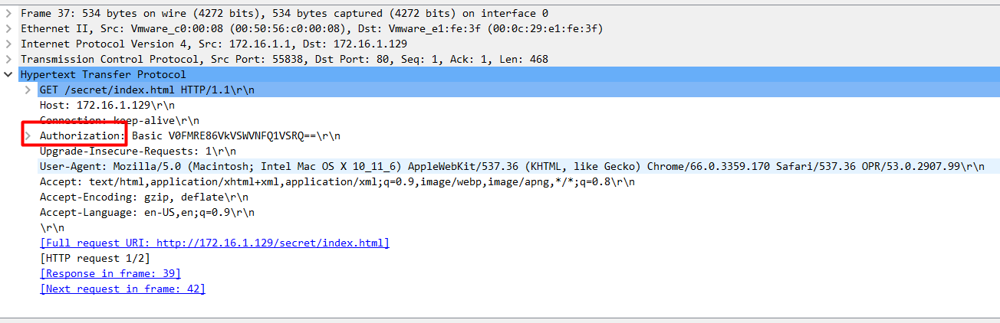

Sau khi kích vào `Authorization`, ta đã thấy được mật khẩu của user `WALDO` là `VERYSECURE`

