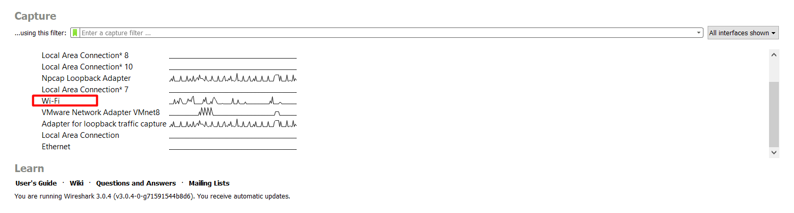
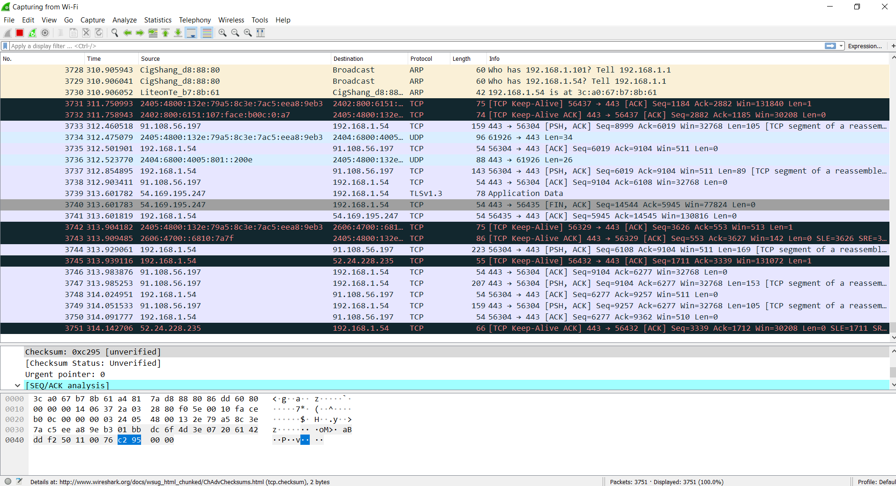
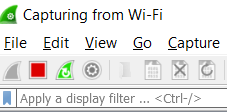
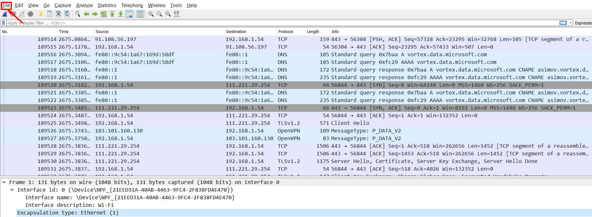
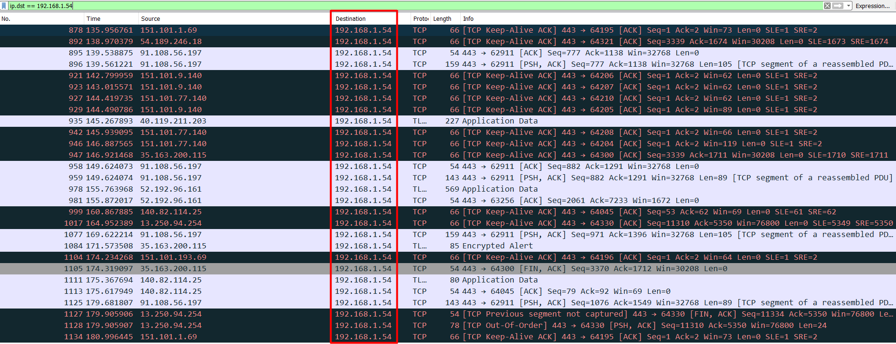
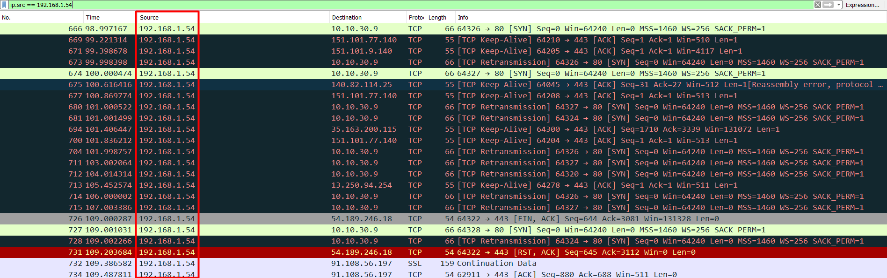
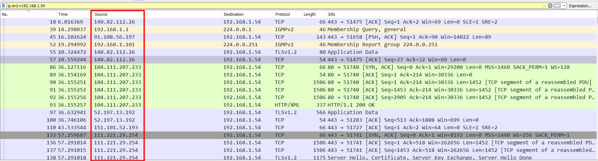
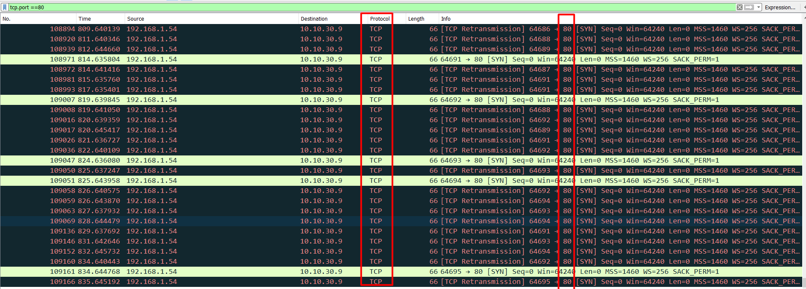
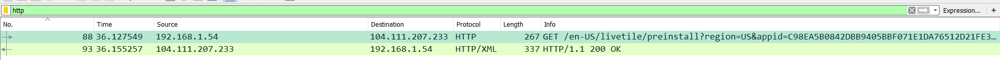
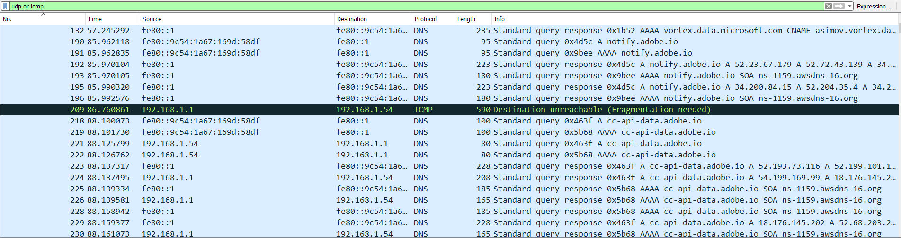

# Sử dụng wireshark cơ bản 

Wireshark là công cụ phân tích giao thức mạng phổ biến nhất thế giới, nó cho phép ta xem lưu lượng truy cập và phân tích những gì đang diễn ra trong mạng. Ta có thể sử dụng wireshark để chuẩn đoán sự cố và tìm lỗi hổng mạng

## Trước tiên ta sẽ bắt đầu với các giao diện mạng trên máy. 

Kích đúp vào 1 giao diện nào đó để xem chi tiết lưu lượng các gói tin trên giao diện đó. Mình muốn xem lưu lượng trên giao diện wifi, kích đúp vào `wifi` : 



Sau đó lưu lượng các gói tin đi qua `wifi` sẽ hiển thị như sau : 



ta thấy rằng trên thanh công cụ có 1 nút màu đỏ, đó là nút sử dụng chụp lại lưu lượng hiện tại. 



Sau đó ta có thể lưu lại những gói tin này dưới dạng file pcap bằng cách : 

Kích vào `file` sau đó chọn `save` 



## Open file có sẵn 

Để xem 1 file ta có thể kích vào `file` -> `open` và chọn file `.pcap` có sẵn để xem các gói tin đã chụp lại trước đó. 

Ta có thể sử dụng tcpdump để chụp lại các gói tin qua 1 giao diện mạng trên 1 máy chủ khác và lưu vào file .pcap sau đó chuyển sang máy cài wireshark và mở file đó. 

Lệnh sử dụng để chụp lại 100 gói tin qua 1 giao diện mạng và lưu vào file như sau :

```
tcpdump -i <interface> -c 100 -w <tên_file>.pcap
```

## Sử dụng filter để capture các gói tin mình quan tâm 

Ta có thể sử dụng filter để loại bỏ các gói mà ta không quan tâm. Có thể lọc gói tin khi đang bắt các lưu lượng truy cập hoặc khi đã chụp lại mà muốn giảm kích thước của gói tin và chỉ lấy những gói mà ta quan tâm ta có thể sử dụng filter. 

**Chỉ bắt các gói có IP trùng khớp** 

- Chỉ xem các gói có IP dest trùng khớp 

VD: Chỉ xem các IP dest là ip `192.168.1.54`



- Tương tự như vậy ta chỉ xem các gói có ip src trùng khớp 

VD: Chỉ xem các IP src là ip `192.168.1.54`



- Chỉ xem các gói có cả IP src và IP dest trùng khớp 

VD : Chỉ xem các gói có IP src là `192.168.1.54` và IP dest là `54.189.246.18`


hoặc ta cũng có thể loại trừ các gói với IP nguồn và đích nhất định 

VD: Loại trừ các gói có IP nguồn là `192.168.1.54` 



**Chỉ bắt các gói có port hoặc giao thức trùng khớp** 

- Chỉ xem các gói có TCP port là 80 



- Chỉ bắt các gói sử dụng dịch vụ http 



- Bắt các gói đang sử dụng giao thức UDP hoặc ICMP



Kết thúc phần sử dụng cơ bản của wireshark. 

**Chỉ xem các gói có source port hoặc destination port là 80**

```
tcp.dstport == 80
tcp.srcport == 80
```
