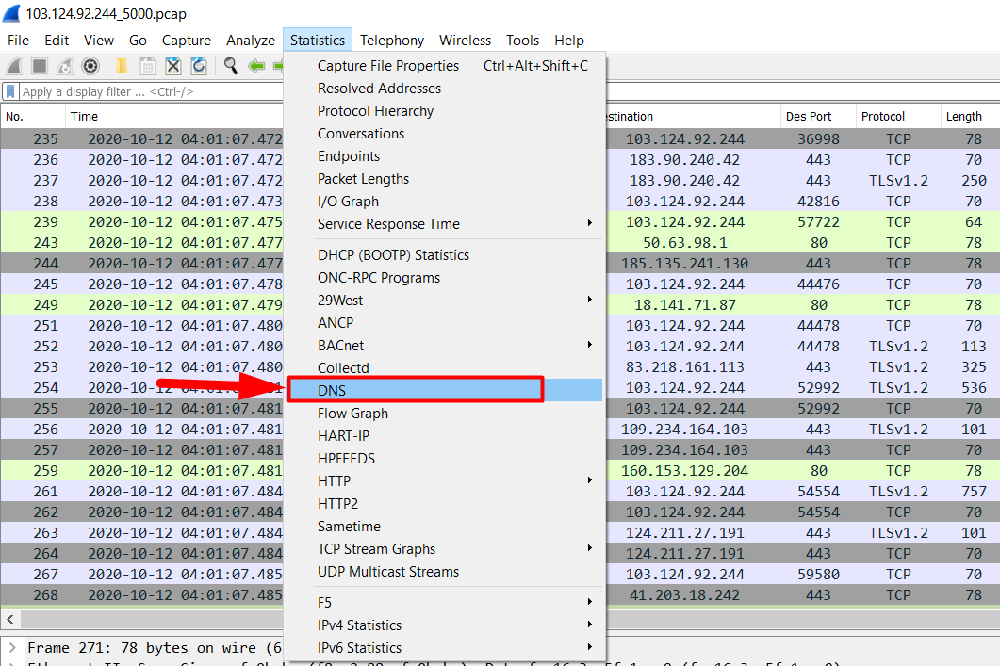

# Wireshark static 

## Static DNS

Bước 1: Kích chọn static

Bước 2: Kích chọn DNS 

Bước 4: Phân tích các thông số 

Ta có thể thấy rằng : 

1. Số gói tin DNS 

2. Số response cho các bản ghi

3. Số query cho các bản ghi

4. Số bản ghi PTR

5. Số query cho bản ghi AAAA (ipv6)

6. Số query cho bản ghi A (ipv4)

## Static HTTP 

Bước 1: Kích chọn static

Bước 2: Kích chọn HTTP và chọn Packet counter

Bước 3: Phân tích các thông số

1. Đây là số gói tin HTTP

2. Số gói tin respon trả về các mã trạng thái 

3. Số gói tin request ứn với các method. 

Bước 4. Kích chọn HTTP và chọn Requests

Ở đây ta có thể xem các request đến các uri của các trang web. Kích vào domain của các trang web để xem các request gửi tới uri nào. 

